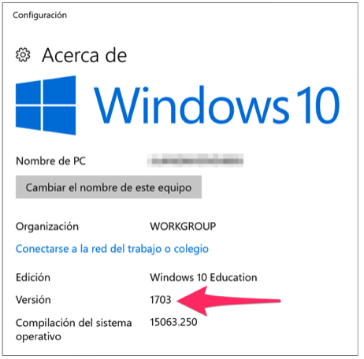
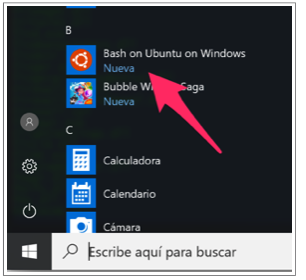

# Configuración de Windows 10

Esta guía describe el proceso de instalación del *Ubuntu on Windows* disponible
en Windows 10 Anniversary Update, Windows 10 Creators Update o posterior
(Compilación 1607+). Seguidamente, se describe la instalación en el Bash de
Anaconda (que incluye Python, IPython y Jupyter), el lenguaje R, RStudio y los
kernels para Jupyter de R (IRkernel) y Bash (IBash).


### Paso 1
Verifique que su instalación de Windows 10 permite la configuración de Ubuntu.
Haga clic derecho sobre el logo de Windows. Abra
**`Configuración > Sistema > Acerca de`**.


### Paso 2
Verifique la compilación en la ventana **`Acerca de`**. Su compilación debe ser
1607 o superior. Si su equipo no cumple este requisito, actualice su versión del
sistema operativo o recurra a otra alternativa como Cygwin.



### Paso 3
Haga click derecho sobre el logo de Windows, abra **`Configuración`** y baje
hasta **`Actualización y Seguridad`**.


### Paso 4
Haga click en **`Para Programadores`**.

### Paso 5
Seleccione el **`Modo de Programador`**. Windows instalará los paquetes del
modo de programador.

### Paso 6
Haga click con el botón derecho en el logo de Windows en la barra de tareas y
abra el **`Windows PowerShell (Administrator)`**.

### Paso 7
Ejecute el siguiente comando en el PowerShell para activar el Subsistema de Linux

```
Enable-WindowsOptionalFeature -Online - FeatureName Microsoft-Windows-Subsystem-Linux
```

### Paso 8
Ejecute el comando
```
Bash
```
en el Powershell. El sistema instalará
**`Ubuntu-on-Windows`** desde la tienda de aplicaciones de windows.


### Paso 9
Continue con la configuración del prompt respondiendo las preguntas realizadas
por el instalador. Debe suministrar un nombre de usuario y contraseña. Cuando
finalice la instalación, debe encontrar la aplicación Bash instalada en el
sistema.




### Paso 10 (Python)
Descargue Anaconda con el siguiente comando en Bash:
```
wget  https://repo.anaconda.com/archive/anaconda3-5.2.0-Linux-x86_64.sh
```

### Paso 11
Instale Anaconda
```
bash Anaconda3-5.2.0-Linux-x86_64.sh
```

### Paso 12
Cierre la ventana de Bash y vuelva a abrirla. Todos los servicios de Anaconda
estarán disponibles para su uso.


### Paso 13
Instale los paquetes requeridos por Python. El listado se encuentra
en el archivo [lista-python.md](lista-python.md)


### Paso 13
Para instalar el lenguaje R, ejecute el siguiente comando en Bash. El sistema
pedirá su contraseña para poder continuar.

```
sudo apt-get install r-base
```

### Paso 14
Instale las librerías requeridas por el IRkernel ejecutando los siguientes
comandos en Bash.

```
sudo apt-get install libcurl4-openssl-dev
```

```
sudo apt-get install build-essential
```

```
sudo apt-get install libcurl4-gnutls-dev
```

```
sudo apt-get install libxml2-dev
```

```
sudo apt-get install libssl-dev
```

### Paso 15
Abra el interprete de R en la línea de comandos:

```
sudo -i R
```

### Paso 16
En el prompt de R, ejecute los siguientes comandos para instalar el IRkernel.

```
install.packages('repr')
```

```
install.packages('IRdisplay')
```

```
install.packages('evaluate')
```

```
install.packages('crayon')
```

```
install.packages('pbdZMQ')
```

```
install.packages('devtools')
```

```
install.packages('uuid')
```

```
install.packages('digest')
```

```
devtools::install_github('IRkernel/IRkernel')
```

### Paso 17
Salga de R con el comando **`quit()`**

### Paso 18
Abra R en la consola de comandos:

```
R
```

### Paso 19
Finalice la instalación del IRkernel ejecutando en R el siguiente comando:

```
IRkernel::installspec(user = FALSE)
```

### Paso 20
Verifique que el kernel fue correctamente instalado. Abra Jupyter desde Bash con
el siguiente comando:
```
jupyter notebook
```

### Paso 21
En el menú **`New`** de Jupyter debe aparece la opción de crear notebooks que
usen el lenguaje R.


### Paso 22
Instale los paquetes de R que aparecen en el archivo [lista-R.md](lista-R.md)


### Paso 23 (IBash)
Abra Bash y ejecute el siguiente comando:
```
sudo chmod u=rwx,g=rwx,o=rwx /usr/local/share
```

### Paso 24
Instale **`IBash`**.

```
pip install bash_kernel
```

```
python -m bash_kernel.install
```

### Paso 25
En el menú **`New`** de Jupyter debe aparece la opción de crear notebooks en
Bash.


