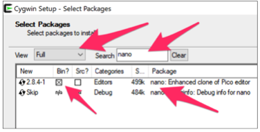
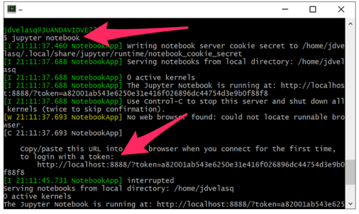
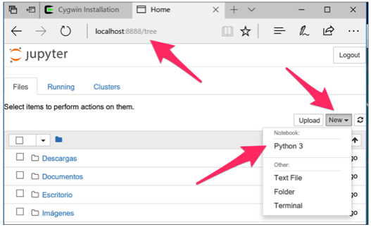

# Configuración de Windows 8 y 10

Esta guía describe el proceso de instalación y configuración de Cygwin para
Windows 8 y las versiones de Windows 10 que **NO** permiten instalar el
subsistema de Linux para Windows (Bash on Ubuntu on Windows). Este documento
incluye instrucciones detalladas para instalar R, Python, IPython / Jupyter
y sus kernels.


### Paso 1 (Cygwin)
Descargue el instalador de Cygwin en
[https://cygwin.com/install.html](https://cygwin.com/install.html).

### Paso 2
Ejecute la instalación. Cuando llegue a la opción **`Selected Packages`**,
seleccione:

* `nano`
* `python3-devel`
* `python3-zmq`
* `python3-pip`
* `python3-ipython`
* `python3-ipython_genutils`
* `R`

Se instalarán Python 3.x y R, y se podrán ejectuar desde la interfaz de comandos
de Cygwin.




### Paso 3
Cuando finalice la instalación, abra el **`Terminal`** de Cywgin y ejecute el
comando
```
pip3 install jupyter
```

### Paso 4
Verifique la instalación de Jupyter. Para abrir Jupyter use el comando
```
jupyter notebook
```
en el Terminal de Cygwin. Luego copie el token en el portapapeles.



Abra *Internet Explorer* (o *Edge*) y pegue el token en la barra de direcciones.
Esta acción abrirá el *Jupyter Dashboard* como se muestra en la gráfica que
aparece abajo.



### Paso 5
Instale los kernels para el lenguaje R y para Bash tal como se indica en la
[guía de instalación para Ubuntu](ubuntu.md).

**Nota:** En la guía de instalación de Ubuntu, los usuarios de Cygwin deben
reemplazar **`pip`** por **`pip3`**.
